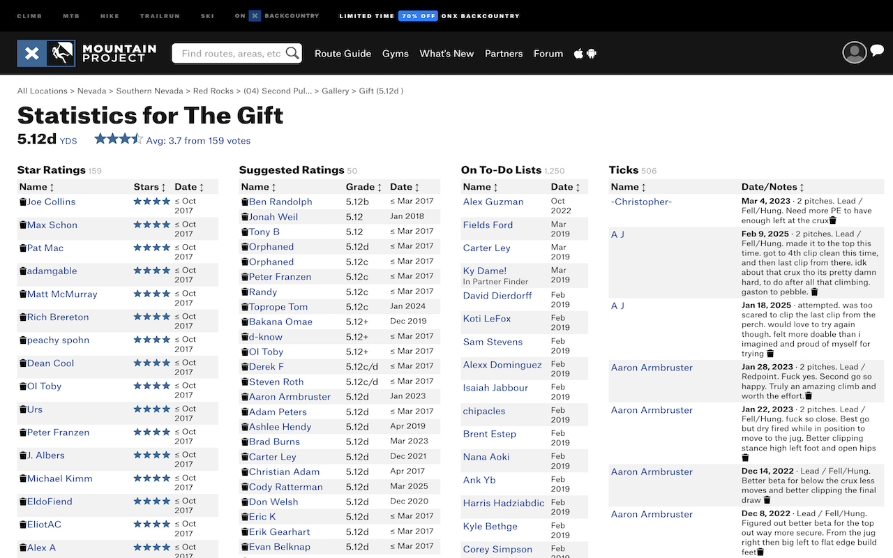

#  Mountain Project Stats Enhanced

This is a simple Chrome extension that adds dates to the stars, grades, and todos on the stats page of any Mountain Project route and makes these tables sortable by any column. The sizing of the columns on large screens is slightly adjusted to accommodate this additional info.

## Installation

Add the extension to your Chrome browser from the [extension page](https://chromewebstore.google.com/detail/mountain-project-stats-en/cmlpgcdikcefgegfgehkhmigmcjocgka) or by cloning/downloading this repository and [adding it manually](https://developer.chrome.com/docs/extensions/get-started/tutorial/hello-world#load-unpacked).

## Use Cases

- Determining what time of year a route is climbed when tick data is insufficient
- Noticing trends in quality or difficulty over time, e.g. due to a climb breaking at some point
- Determining recency of TODO list additions for partner finding
- Quickly viewing the min/max grade or star ratings using the new sorting functionality

## Known Issues

- MP did not appear to record timestamps prior to certain dates in 2017 depending on the data, so any timestamps marked with that date are relabelled with e.g. "≤ Mar 2017" for simplicity. Those entries could be from any date Mar 2017 or earlier.
- MP paginates stats pages with large numbers of entries. This makes the sorting feature fairly useless on paginated tables until the whole table has been loaded manually by scrolling and clicking "Show More" repeatedly.
- Sorting by grades on routes which use multiple grading systems (i.e. 5.12c V6) will usually not work correctly, as the sorting function just picks the first grade it sees.
